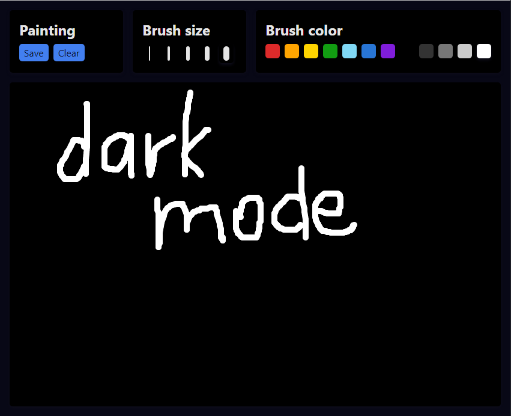

# react-paint

Drawing app made with React and TypeScript

<div>
  
  
</div>

## Features

- Supports different brush sizes and colors
- Can save paintings to the device
- Works on mobile devices
- Supports dark mode

## Development

### Prerequisites

- Node.js and npm (yarn)

### Setup

1. Clone the repository

```bash
git clone https://github.com/ivteplo/react-paint
```

2. Navigate to the project's root folder

```bash
cd react-paint
```

3. Install dependencies

```bash
npm install
# or, if you prefer yarn:
yarn install
```

4. Start the development server

```bash
npm run dev
```

5. Happy hacking! 🎉
