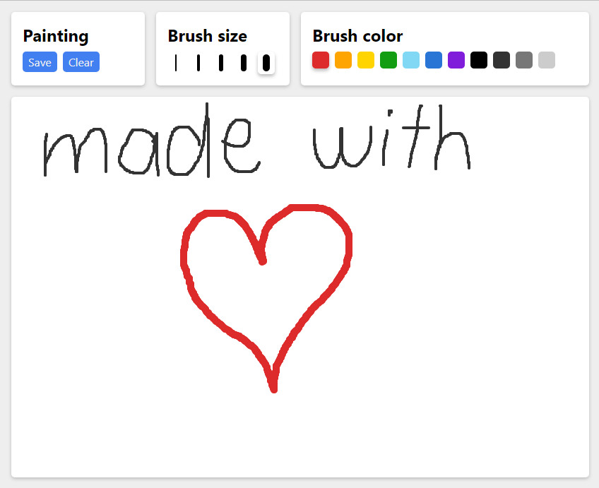

# react-paint

Drawing app made with React and TypeScript

<div></div>

## Features

- Supports different brush sizes and colors
- Can save paintings to the device
- Works on mobile devices

## Development

### Prerequisites

- Node.js and npm (yarn)

### Setup

1. Clone the repository

```shell
git clone https://github.com/ivteplo/react-paint
```

2. Navigate to the project's root folder

```shell
cd react-paint
```

3. Install dependencies

```shell
npm install
# or, if you prefer yarn:
yarn install
```

4. Start the development server

```shell
npm run dev
```

5. Happy hacking! 🎉
